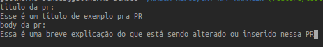
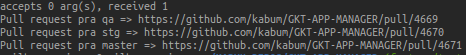

# AUTOMATIZAÇÃO DE PRs

## Antes de tudo
### Instalar a cli do github
   Antes de começar a usar o script, é necessário instalar a cli do github:  
   `sudo snap install gh`  
   Essa cli é a que suporta os comandos do github via shell.  

### Mover o .sh para o diretorio raiz do manager
   É necessário mover o arquivo .sh para o diretório raiz do manager. A árvorvore de diretórios raiz do manager deve ficar assim:  

   |- GKT-APP-MANAGER   
   |---- APP  
   |---- |----  
   |---- GLOBAL  
   |---- |----  
   |---- README.md  
   |---- bash_git_manager.sh  

### Mudar a permissão do arquivo
   É necessário dar permissão de execução ao arquivo .sh  
   `chmod +x bash_git_manager.sh`  
   obs: é necessário estar dentro do diretorio de onde o script está, obviamente.  

## Inputar os seus dados no script
### TOKEN
   Na linha 13 coloque seu token do github no lugar de <seu_token>  
   antes:  
   `gh auth login --with-token <seu_token>`  
   depois:  
   `gh auth login --with-token 596d642eedaf6449d9b5cbd74c150dccb64f689d`  

### Alterar o nome do seu usuário do github
   Na linha 9 deve ser inputado o seu nome de usuário  
   Esse nome de usuário é o mesmo que aparece na sua url do github, por exemplo:  
   `https://github.com/guilhermesimoes-kabum/`  
   O nome que deve ser inputado nas linhas mensionadas é o `guilhermesimoes-kabum`  

   antes:  
   `user_name=<seu_nome>`  

   depois:  
   `user_name='guilhermesimoes-kabum'`  

## Como usar
   Simplesmente no diretório raiz do manager, rode o seguinte comando:  
   `./bash_git_manager.sh`

   Ele vai rodar os testes do sistema. Caso algum falhe miseravelmente, ele não vai deixar você abrir a PR 

   Ele vai te pedir um título da PR e um Body:  
   

   Depois que vc inputar o título e o body, ele vai te devolver as urls das prs abertas:  
   
